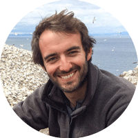
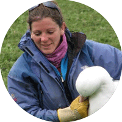

+++
# Project title.
title = "2019 BES Quantitative & Movement Ecology SIG Annual Meeting"

# Date posted
date = 2019-05-22

# Date of the event
start_date = 2019-07-09

# Optional end date for more than one day
end_date = 2019-07-10

# Location of event
location = "Alfred Denny Building, Sheffield, S3 7HG"

# Event summary to display on homepage.
summary = "Join us for the 2019 joint BES Quantitative and Movement Ecology special interest groups annual meeting in Sheffield!"

# Tags: can be used for filtering projects.
# Example: `tags = ["machine-learning", "deep-learning"]`
tags = ["R", "spatial", "movement", "event", "conference", "Conferences"]

# Optional external URL for project (replaces project detail page).
external_link = ""

# Featured image
# To use, add an image named `featured.jpg/png` to your project's folder. 
[image]
  # Caption (optional)
  caption = "Double-crested cormorant flying at speed. Photo credit: Christopher Martin" 

  # Focal point (optional)
  # Options: Smart, Center, TopLeft, Top, TopRight, Left, Right, BottomLeft, Bottom, BottomRight
  focal_point = "Center"
+++

The BES Quantitative and Movement Ecology special interest groups will be holding their annual meetings back to back **on 9th & 10th July 2019 in Sheffield**. This joint meeting will take advantage of shared strengths as well as shared challenges between the two groups, and foster links between them.

The meeting will be along the common theme of Analysing big datasets while answering big ecological questions and the challenges associated with it. We welcome talks, posters and will have discussions on general issues with computation; integrating different datasets; and propagating uncertainty in ecological analyses.

Attendees will have the opportunity to attend one, or both annual meetings. Note that it is cheaper to join the BES as a member and register for a BES member ticket, than to register for the non-BES member ticket.

## Quantitative Ecology keynotes

 

<table>
  <tr>
    <td class="leftcol"></td>
    <td class="rightcol">
    <table><b><a href = "http://www.jamesgrecian.com/">James Grecian</a></b> 
      University of St Andrews</table>
      
 James' research focuses on understanding how marine predators interact with their environment, particularly the effect that human impacts such as offshore energy extraction, fisheries and climate change have on foraging behaviour and migration.

    </td>
  </tr>
</table>

<table>
  <tr>
    <td class="leftcol"></td>
    <td class="rightcol">
    <table><b><a href = "https://www.kent.ac.uk/mathematics-statistics-actuarial-science/people/1060/mccrea-rachel">Rachel McCrea</a></b> 
      University of Kent</table>
      
 Rachel is an applied statistician working closely with ecologists as well as statisticians, developing new statistical methodology for the modelling of ecological data. She has worked extensively with capture-recapture data and is particularly interested in the potential of multi-state models. Her research has included the development of goodness-of-fit assessment and model selection strategies for complex data sets.  Modelling population dynamics, integrated population modelling and survey design are also current areas of interest.

    </td>
  </tr>
</table>

## Movement Ecology Keynotes

 

<table>
  <tr>
    <td class="leftcol"></td>
    <td class="rightcol">
    <table><b><a href = "https://samanthacpatrick.wixsite.com/home">Samantha Patrick</a></b> 
      University of Liverpool</table>
      
 Samantha is a behavioural ecologist interested in individual differences in mating strategies. She focuses on reproductive tactics and foraging behaviour and considers how and why alternative strategies are maintained in the population. She has worked mainly on avian systems, from great tits to albatrosses, and examined the causes and consequence of individual variation.

    </td>
  </tr>
</table>

<table>
  <tr>
    <td class="leftcol"></td>
    <td class="rightcol">
    <table><b><a href = "https://www.researchgate.net/profile/Karine_Heerah">Karine Heerah</a></b> 
      Aarhus University</table>
      
 Karine is a Marie Sklodowska Curie Fellow working in the lab of Prof. Peter Madsen at Aarhus University.

    </td>
  </tr>
</table>

<table>
  <tr>
    <td class="leftcol"></td>
    <td class="rightcol">
    <table><b><a href = "http://theo-michelot.postgrad.shef.ac.uk/">Théo Michelot</a></b> 
      University of St Andrews</table>
      
 Théo is a newly appointed Research Fellow in the School of Mathematics and Statistics at the University of St Andrews. He specialises in analyses of animal movement.

    </td>
  </tr>
</table>

<table>
  <tr>
    <td class="leftcol"></td>
    <td class="rightcol">
    <table><b><a href = "https://www.gla.ac.uk/researchinstitutes/bahcm/staff/granthopcraft/">Grant Hopcraft</a></b> 
      University of Glasgow</table>
      
 Grant's research broadly investigates landscape-scale ecological processes that determine the distribution and abundance of animals. He focuses on African savannahs as model ecosystems to investigate how underlying biogeographical gradients, such as rainfall and soil fertility, influence animal nutrition and predation rates, and how these gradients structure community assemblages.

    </td>
  </tr>
</table>

## TALKS AND POSTERS

We will have slots for talks and space for posters at the meeting!

Talks will be **5 minutes** long. There may not be enough talk slots for everyone, so priority will be given to early career researchers. Please include a rough title when you register so we have an idea of the balance of topics (you can change it later). Students will also be given the option to put themselves forward for the student plenary talk (20 minutes). We highly recommend applying; it's fun and a great thing to put on your CV.

## ACCESSIBILITY 

All facilities, rooms and spaces in the conference venue are wheelchair-accessible and there are disabled parking spaces nearby. See https://www.accessable.co.uk/venues/alfred-denny-building for more information and please contact us if you have any questions.

## FAMILIES AND CHILDCARE

If you plan to bring your baby or young child to the meeting, please get in touch with us to let us know what facilities you would require, for example, a room for nursing or créche facilities. We have not made any specific arrangements for families but we will be happy to help as much as we can.

## ACCOMMODATION

https://www.sheffield.ac.uk/accommodation/visitors

## TWITTER

#BESQuantMove2019

## DEADLINE

The deadline for registration is **Friday, 7th June 2019** (11:59 PM UK time). We will contact attendees after this to confirm talk slots.

## REGISTER

You can register on our [EventBrite](https://www.eventbrite.co.uk/e/bes-quantitative-movement-ecology-2019-tickets-59447350626) page.

## CONTACT

Feel free to contact us on twitter [@bes_qe_sig](https://twitter.com/BES_QE_SIG) and [@bes_move_sig](https://twitter.com/BES_Move_SIG) or by emailing [quantitative@britishecologicalsociety.org](mailto:quantitative@britishecologicalsociety.org) or [movement@britishecologicalsociety.org](mailto:movement@britishecologicalsociety.org) 

